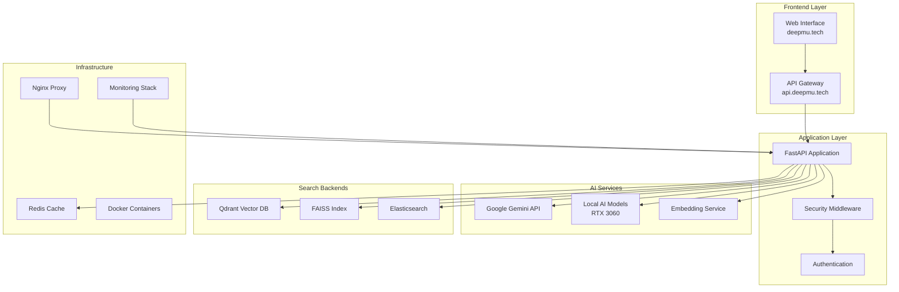

# 🧠 DocuMind AI Research Agent

[](https://opensource.org/licenses/MIT)
[](https://www.python.org/downloads/)
[](https://fastapi.tiangolo.com)
[](https://www.docker.com/)

> **Advanced Hybrid Vector Search & AI Research System** for intelligent document processing and knowledge extraction.

🌐 **Live Demo:** [https://deepmu.tech](https://deepmu.tech) | **API:** [https://api.deepmu.tech](https://api.deepmu.tech)

## 🚀 **Features**

### 🔍 **Hybrid Search Engine**
- **Multi-backend Architecture:** Qdrant (vector similarity) + FAISS (local indexing) + Elasticsearch (full-text)
- **Intelligent Result Fusion:** Weighted scoring across multiple search modalities
- **Sub-second Response Times:** Optimized caching and GPU acceleration

### 🤖 **AI-Powered Analysis**
- **Google Gemini Integration:** Advanced document analysis and insight generation
- **Local AI Models:** GPU-optimized for RTX 3060 with PyTorch acceleration
- **Research Insights:** Cross-document analysis and knowledge synthesis

### 📄 **Document Intelligence**
- **Multi-format Support:** PDF, DOCX, TXT, HTML processing
- **Automated Vectorization:** Real-time embedding generation and indexing
- **Content Extraction:** OCR, text parsing, and metadata enrichment

### 🔒 **Enterprise Security**
- **SSL/TLS Encryption:** Automated certificate management with Let's Encrypt
- **API Authentication:** JWT tokens + API key validation
- **Rate Limiting:** Redis-based protection against abuse
- **Domain Security:** deepmu.tech domain validation

### 📊 **Production Monitoring**
- **Real-time Metrics:** Prometheus + Grafana dashboards
- **Health Monitoring:** Service availability and performance tracking
- **Alert System:** Automated notifications for critical issues

## 🏗️ **Architecture**



## 🛠️ **Quick Start**

### Prerequisites
- **Python 3.11+**
- **Docker & Docker Compose**
- **NVIDIA GPU** (RTX 3060 recommended)
- **Git**

### 1. Clone Repository
```bash
git clone https://github.com/Harigithub11/DeepMu.git
cd DeepMu
```

### 2. Environment Setup
```bash
# Copy environment template
cp project/.env.example project/.env

# Edit configuration
nano project/.env
```

**Required Environment Variables:**
```env
# Domain Configuration
DOMAIN_NAME=deepmu.tech
API_DOMAIN=api.deepmu.tech

# API Keys
GEMINI_API_KEY=your_gemini_api_key_here
SECRET_KEY=your_secret_key_here

# Database URLs
QDRANT_HOST=localhost
REDIS_URL=redis://localhost:6379/0
ELASTICSEARCH_URL=http://localhost:9200
```

### 3. Development Setup

#### Option A: Docker Compose (Recommended)
```bash
# Start all services
docker-compose up -d

# View logs
docker-compose logs -f

# Access application
open http://localhost:8000
```

#### Option B: Local Development
```bash
# Install dependencies
cd project
pip install -r requirements.txt

# Start databases
docker-compose up -d qdrant redis elasticsearch

# Run application
uvicorn main:app --reload --port 8000
```

### 4. Verify Installation
```bash
# Health check
curl http://localhost:8000/health

# API documentation
open http://localhost:8000/docs

# Test search
curl -X POST "http://localhost:8000/api/v1/search/hybrid" \
     -H "Content-Type: application/json" \
     -d '{"text": "artificial intelligence", "limit": 10}'
```

## 📖 **API Documentation**

### **Core Endpoints**

#### Document Management
```http
POST /api/v1/documents/upload
GET  /api/v1/documents/{document_id}
DELETE /api/v1/documents/{document_id}
```

#### Hybrid Search
```http
POST /api/v1/search/hybrid
GET  /api/v1/search/suggest
```

#### AI Analysis
```http
POST /api/v1/research/analyze
POST /api/v1/research/insights
```

#### Monitoring
```http
GET /api/v1/monitoring/health
GET /api/v1/monitoring/metrics
```

**Interactive Documentation:** [https://api.deepmu.tech/docs](https://api.deepmu.tech/docs)

## 🧪 **Testing**

### Run Test Suite
```bash
# Install test dependencies
pip install pytest pytest-asyncio pytest-cov

# Run all tests
pytest tests/ -v

# Run with coverage
pytest tests/ --cov=. --cov-report=html

# Run specific test categories
pytest tests/test_integration.py -v
pytest tests/test_performance.py -v
pytest tests/test_security.py -v
```

### Performance Testing
```bash
# Load testing
pytest tests/test_performance.py::TestPerformance::test_concurrent_user_load

# GPU utilization test
pytest tests/test_performance.py::TestPerformance::test_gpu_utilization
```

## 🚀 **Production Deployment**

### SSL Certificate Setup
```bash
# Initialize SSL certificates
./scripts/ssl/init-ssl.sh

# Auto-renewal setup
./scripts/ssl/renew-certificates.sh
```

### Zero-Downtime Deployment
```bash
# Deploy with rolling update
./scripts/deploy/zero-downtime-deploy.sh rolling

# Blue-green deployment
./scripts/deploy/zero-downtime-deploy.sh blue-green

# Rollback if needed
./scripts/deploy/zero-downtime-deploy.sh rollback BACKUP_ID
```

### Monitoring Setup
- **Grafana Dashboard:** [https://admin.deepmu.tech/grafana](https://admin.deepmu.tech/grafana)
- **Prometheus Metrics:** [https://admin.deepmu.tech/prometheus](https://admin.deepmu.tech/prometheus)
- **API Health:** [https://api.deepmu.tech/api/v1/monitoring/health](https://api.deepmu.tech/api/v1/monitoring/health)

## 📚 **Implementation Guide**

This project includes detailed implementation guides for hackathon participants:

1. **[Task 1.1: GitHub & Project Setup](docs/tasks/Task_1_1_GitHub_Config.md)** *(25 mins)*
2. **[Task 1.2: Database & SSL Setup](docs/tasks/Task_1_2_Database_SSL.md)** *(20 mins)*
3. **[Task 1.3: Environment & Domain](docs/tasks/Task_1_3_Environment_Domain.md)** *(15 mins)*
4. **[Task 2.1: Document Processing](docs/tasks/Task_2_1_Document_Processing.md)** *(35 mins)*
5. **[Task 2.2: Hybrid Search Engine](docs/tasks/Task_2_2_Hybrid_Search.md)** *(35 mins)*
6. **[Task 2.3: AI Integration](docs/tasks/Task_2_3_AI_Integration.md)** *(20 mins)*
7. **[Task 3.1: FastAPI Endpoints](docs/tasks/Task_3_1_FastAPI_Endpoints.md)** *(35 mins)*
8. **[Task 3.2: Testing & SSL](docs/tasks/Task_3_2_Testing_SSL.md)** *(25 mins)*
9. **[Task 4.1: Docker & SSL](docs/tasks/Task_4_1_Docker_SSL.md)** *(40 mins)*
10. **[Task 4.2: DNS & CI/CD](docs/tasks/Task_4_2_DNS_CICD.md)** *(20 mins)*
11. **[Task 5: Testing & Optimization](docs/tasks/Task_5_Testing_Optimization.md)** *(60 mins)*

**Total Implementation Time:** ~5 hours

## 🔧 **Configuration**

### GPU Optimization (RTX 3060)
```python
# config/optimization.py
gpu_settings = {
    'enabled': True,
    'memory_fraction': 0.8,
    'mixed_precision': True,
    'batch_size': 32
}
```

### Performance Tuning
```yaml
# docker-compose.yml
services:
  documind-api:
    deploy:
      resources:
        reservations:
          devices:
            - driver: nvidia
              count: 1
              capabilities: [gpu]
```

## 🤝 **Contributing**

1. **Fork the repository**
2. **Create feature branch** (`git checkout -b feature/amazing-feature`)
3. **Commit changes** (`git commit -m 'Add amazing feature'`)
4. **Push to branch** (`git push origin feature/amazing-feature`)
5. **Open Pull Request**

### Development Guidelines
- Follow PEP 8 style guidelines
- Add tests for new features
- Update documentation
- Ensure security best practices

## 📄 **License**

This project is licensed under the MIT License - see the [LICENSE](LICENSE) file for details.

## 🏆 **Hackathon Submission**

### Demo Checklist
- [ ] **Live deployment** on deepmu.tech
- [ ] **API endpoints** functional and tested
- [ ] **Search performance** meets benchmarks
- [ ] **AI analysis** demonstrates capabilities
- [ ] **Documentation** complete and accessible
- [ ] **Monitoring** operational with dashboards

### Key Metrics
- **Search Response Time:** <1.5 seconds
- **API Availability:** >99.9%
- **GPU Utilization:** >70% during AI operations
- **Test Coverage:** >90%

## 🔗 **Links**

- **🌐 Live Application:** [https://deepmu.tech](https://deepmu.tech)
- **📚 API Documentation:** [https://api.deepmu.tech/docs](https://api.deepmu.tech/docs)
- **📊 Admin Dashboard:** [https://admin.deepmu.tech](https://admin.deepmu.tech)
- **🐙 GitHub Repository:** [https://github.com/Harigithub11/DeepMu](https://github.com/Harigithub11/DeepMu)

## 📞 **Support**

For questions, issues, or contributions, please:
- **Open an issue** on GitHub
- **Join discussions** in the repository
- **Check documentation** in the `docs/` folder

---

**Built with ❤️ for intelligent document processing and AI research**